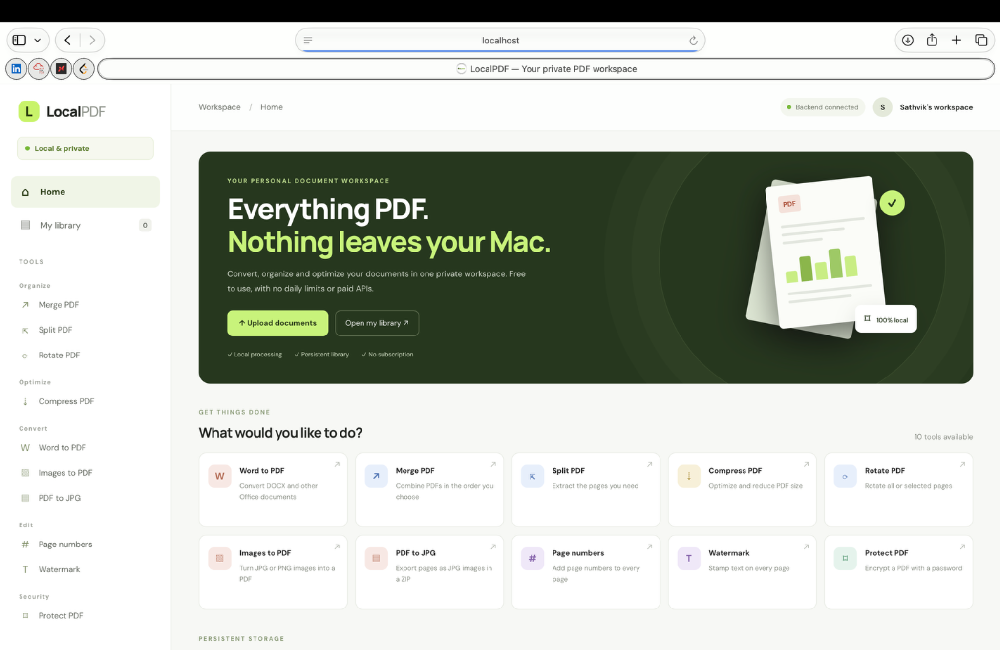
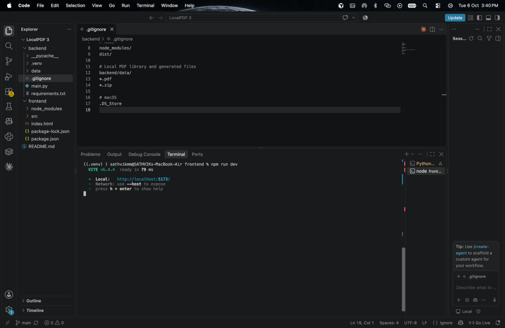
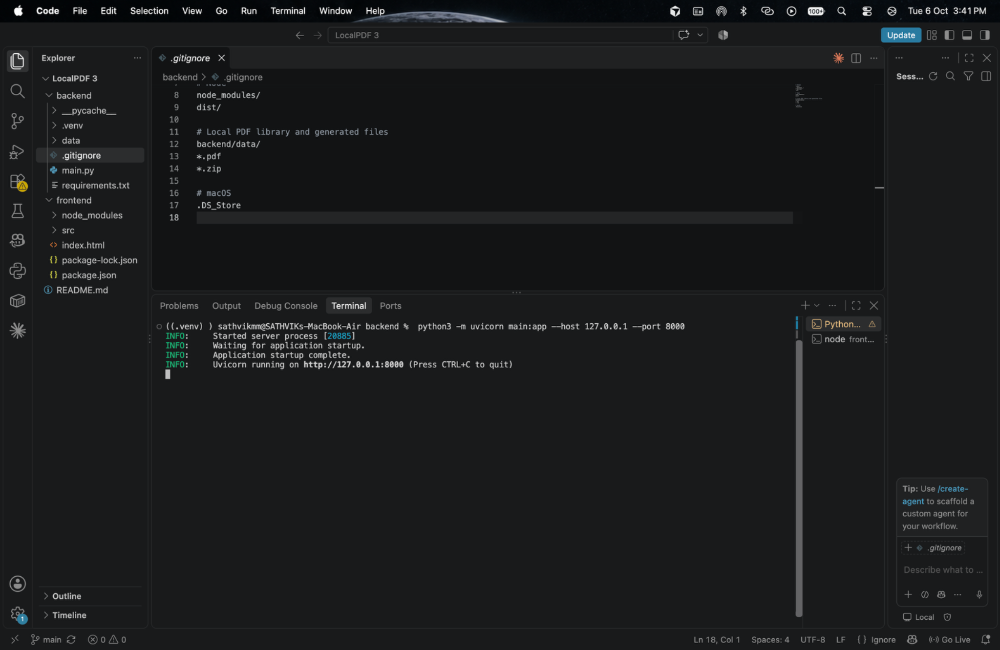

# LocalPDF — Your Private PDF Workspace

A free, locally run PDF toolkit for converting, organizing, and managing documents on your own computer.

## Why I built LocalPDF

When I used free online PDF tools, I often ran into limits on how many documents I could convert at once. Converting a few files was free, but processing a larger batch—such as 10–15 Word documents—could require a premium subscription. I built LocalPDF for my own use so I could convert and manage my documents locally without depending on an online conversion service or paying just to unlock a larger batch.

## Screenshots

### 1. LocalPDF workspace


### 2. Frontend development server


### 3. Backend API server


## Features

- **Word to PDF** — convert DOCX and supported Office documents; batch conversion is designed to help process multiple documents.
- **Merge PDF** — combine PDF files in the order you choose.
- **Split PDF** — extract selected pages or a page range.
- **Rotate PDF** — rotate all pages or selected pages.
- **Compress PDF** — reduce file size where possible.
- **Images to PDF** — convert JPG/PNG images into a PDF.
- **PDF to JPG** — export PDF pages as JPG images in a ZIP archive.
- **Page numbers** — add page numbers to PDF pages.
- **Watermark** — stamp text onto pages.
- **Protect PDF** — encrypt a PDF with a password.
- **Local document library** — keep and manage documents on the computer running the backend.
- **Local-first processing** — use the app on your own machine instead of uploading documents to a third-party website.

Conversion support and output quality can depend on the input file and installed local tools.

## Tech stack

- **Frontend:** React, Vite, JavaScript, HTML, CSS
- **Backend:** Python, FastAPI, Uvicorn
- **Storage:** Local filesystem for the document library
- **Document processing:** Python PDF/image libraries and any locally installed conversion tools used by the backend

## Project structure

```text
LocalPDF/
├── backend/
│   ├── main.py
│   ├── requirements.txt
│   ├── .gitignore
│   └── data/                 # Local document library; do not commit user files
├── frontend/
│   ├── src/
│   ├── index.html
│   ├── package.json
│   └── package-lock.json
├── docs/
│   └── images/               # README screenshots
└── README.md
```

## Requirements

- Python 3
- Node.js and npm
- LibreOffice installed and available on your system PATH if your Word-to-PDF conversion uses LibreOffice

Check versions:

```bash
python3 --version
node --version
npm --version
```

## Run locally on macOS

Open two Terminal tabs (or two terminals in VS Code) and keep both servers running.

### 1. Start the backend

From your project's `backend` directory:

```bash
python3 -m venv .venv
source .venv/bin/activate
python3 -m pip install --upgrade pip
python3 -m pip install -r requirements.txt
python3 -m uvicorn main:app --host 127.0.0.1 --port 8000
```

The backend command used for this project is:

```bash
python3 -m uvicorn main:app --host 127.0.0.1 --port 8000
```

Backend URL: `http://127.0.0.1:8000`  
API documentation, if enabled: `http://127.0.0.1:8000/docs`

### 2. Start the frontend

In a second terminal, from your project's `frontend` directory:

```bash
npm install
npm run dev
```

Open the local URL printed by Vite, typically `http://localhost:5173/`.

### 3. Stop the servers

Press `Control + C` in each terminal.

## Privacy and security

- In the local setup above, the backend processes files on your own computer.
- The local library may contain personal documents. Keep `backend/data/` excluded from Git.
- Never commit personal PDFs, exported ZIPs, `.env` files, API keys, passwords, `.venv/`, or `node_modules/`.
- The backend binds to `127.0.0.1`, so this development configuration is intended for access from the same computer, not as a public production service.
- Keep backups of important files and verify important converted documents before relying on them.

## Push to GitHub

Run these commands from the **project root** (the folder containing `backend`, `frontend`, and `README.md`):

```bash
git init
git branch -M main
git add .
git status
git commit -m "Initial commit: LocalPDF PDF toolkit"
git remote add origin https://github.com/YOUR_USERNAME/LocalPDF.git
git push -u origin main
```

Replace `YOUR_USERNAME` with your GitHub username. Before committing, inspect `git status` and confirm private documents, `backend/data/`, `.venv/`, and `frontend/node_modules/` are not staged. If `origin` already exists, check it with `git remote -v` instead of adding it again.

## Troubleshooting

### `zsh: command not found: uvicorn`

Activate the backend virtual environment and launch Uvicorn through Python:

```bash
source .venv/bin/activate
python3 -m uvicorn main:app --host 127.0.0.1 --port 8000
```

If dependencies are missing:

```bash
python3 -m pip install -r requirements.txt
```

### `FileNotFoundError` when running pip

The terminal may be in a folder that was moved or deleted. Run `cd ~`, navigate back to the actual `backend` folder, and retry.

### Frontend dependencies are missing

```bash
npm install
npm run dev
```

### Word-to-PDF conversion fails

Check that the document format is supported and that any required conversion software, such as LibreOffice, is installed and available to the backend process.

## Future improvements

- Automated tests for conversion and page operations
- Better progress feedback for large batches
- Stronger file validation and clearer error messages
- Easier desktop packaging

## Disclaimer

LocalPDF is a personal project provided as-is. Some files may not convert perfectly; check important output before submitting or sharing it.

## Author

**Sathvik M M**

Built to make common PDF tasks easier, more private, and less dependent on premium online tools.
